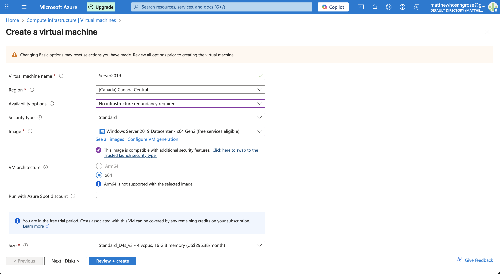
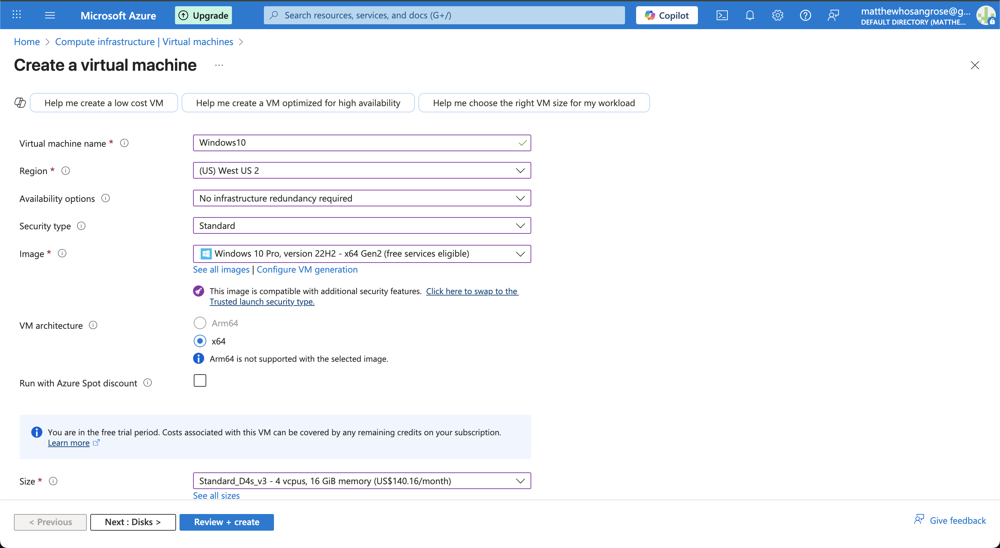
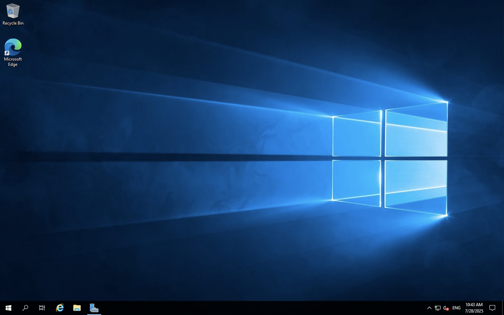
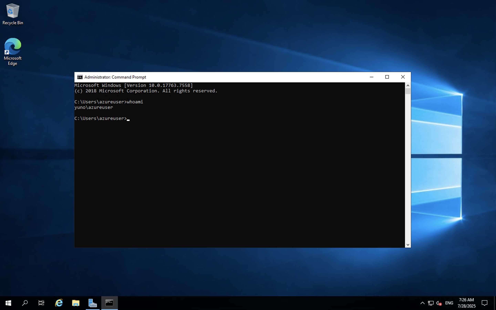
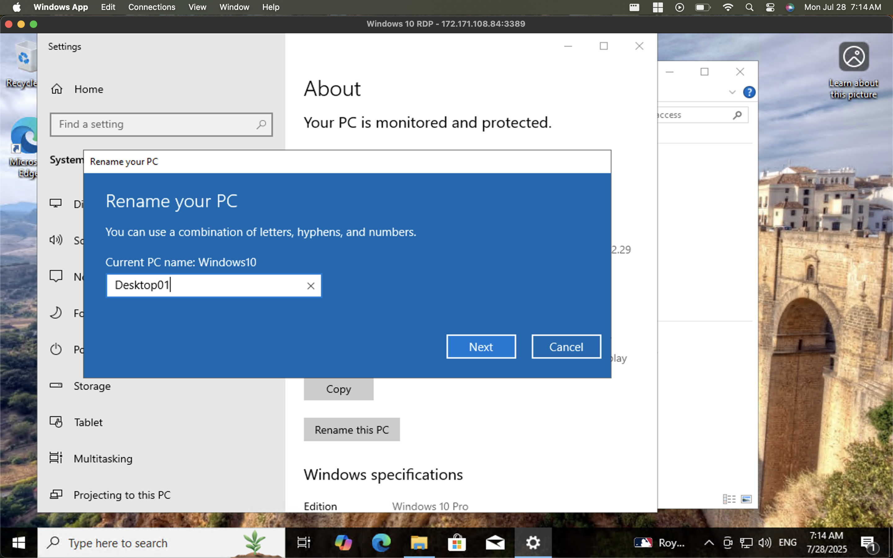
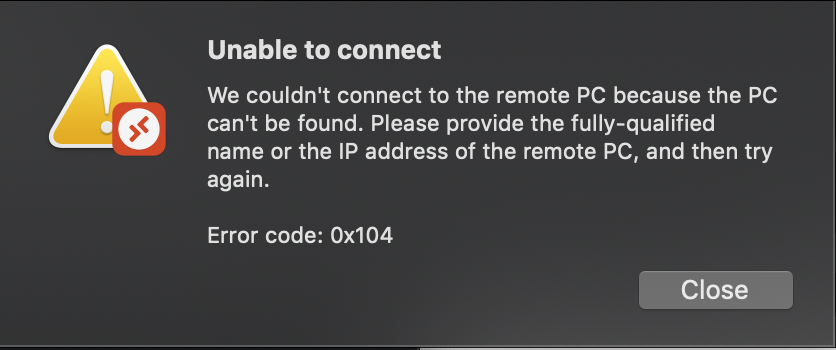
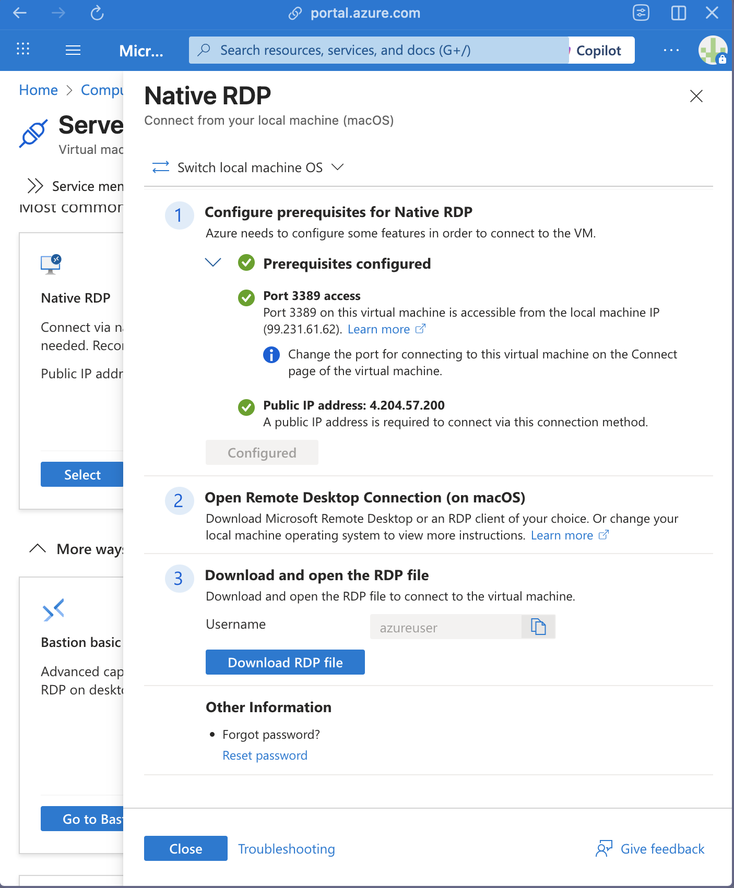

🔧 Azure Lab: Setting Up and Managing Windows VMs

This lab demonstrates how to provision, configure, and access two virtual machines (VMs) on Microsoft Azure: one running Windows Server 2019 and another with Windows 10. The goal is to become familiar with Azure VM provisioning and RDP access from macOS

🖥️ Lab Overview

| Component   | Configuration                    |
| ----------- | -------------------------------- |
| VM 1        | Windows Server 2019 Datacenter   |
| VM 2        | Windows 10 Pro                   |
| Platform    | Microsoft Azure (Free Tier)      |
| RDP Client  | Microsoft Remote Desktop (macOS) |
| Host Device | MacBook (Intel-based)            |

📌 Steps Taken

1. Provisioning the Virtual Machines

* Created two separate VMs:

* VM 1: Windows Server 2019 Datacenter 

* VM 2: Windows 10 Pro

* Chose default settings for networking (with RDP port 3389 open)

* Assigned a username and password for both VMs

* Allowed Azure to assign public IPs for RDP access

2. Accessing VMs via RDP on macOS

* Downloaded the .rdp file for each VM

* Installed Windows app from the Mac App Store

* Double-clicked each .rdp file, then logged in with the VM credentials

* Successfully established RDP sessions for both VMs

3. Initial configuration within the OS

* Renamed each computer

* Adjusted Date and Time settings for local timezone

4. Troubleshooting: Login issue after renaming Windows Server 2019

* After renaming the Windows Server 2019 machine and restarting, I received a login error

* Fix: Edited the .rdp file settings in Azure and changed the local machine OS to macOS 

